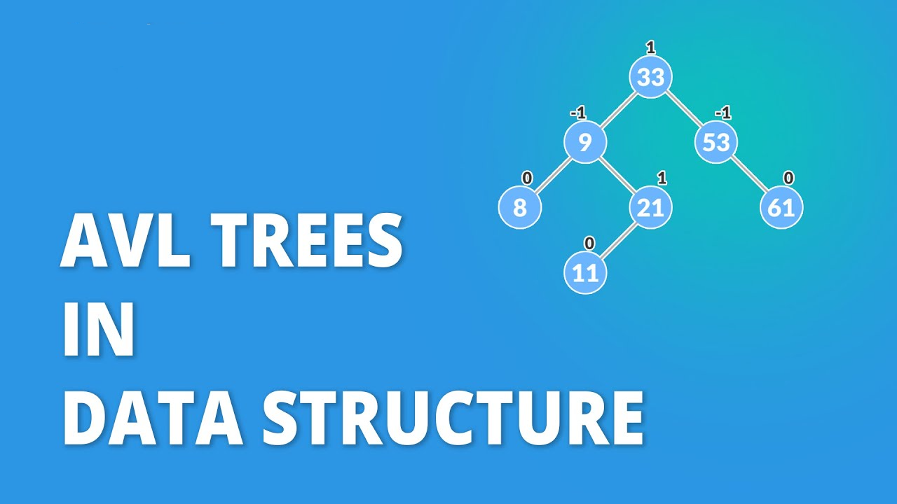

# AVL Tree



## What is an AVL Tree?

An AVL tree is a self-balancing binary search tree where the difference between heights of left and right subtrees (balance factor) cannot be more than 1 for any node. This ensures the tree remains balanced, providing optimal performance for search, insertion, and deletion operations.

Named after its inventors Georgy Adelson-Velsky and Evgenii Landis (1962), AVL trees were the first dynamically balanced trees to be proposed.

## Key Properties

1. **Binary Search Tree Property**: For any node, all values in the left subtree are smaller, and all values in the right subtree are larger.

2. **Balance Factor**: For every node, the balance factor (height of left subtree - height of right subtree) is -1, 0, or +1.

3. **Height Balance**: The tree automatically rebalances itself through rotations when the balance factor becomes ±2.

4. **Height Guarantee**: The height of an AVL tree with n nodes is always O(log n).

---

## Rotation notation and naming convention (`x`, `y`, `T1..T4`)

- `x` — the _lesser_ value (a node whose value < `y`).
- `y` — the _greater_ value (a node whose value > `x`).
- `T1`, `T2`, `T3`, `T4` — subtrees (each can be `null` or another subtree).

## Rotations

AVL trees maintain balance through four types of rotations:

### Single Rotations

- **Right Rotation (LL case)**: Used when left subtree is heavier
- **Left Rotation (RR case)**: Used when right subtree is heavier

### Double Rotations

- **Left-Right Rotation (LR case)**: Left rotation on left child, then right rotation on node
- **Right-Left Rotation (RL case)**: Right rotation on right child, then left rotation on node

## Time Complexity

| Operation | Average Case | Worst Case | Space Complexity |
| --------- | ------------ | ---------- | ---------------- |
| Search    | O(log n)     | O(log n)   | O(1)             |
| Insert    | O(log n)     | O(log n)   | O(log n)\*       |
| Delete    | O(log n)     | O(log n)   | O(log n)\*       |
| Traversal | O(n)         | O(n)       | O(log n)\*       |

\*Due to recursion stack

## Implementation Features

This implementation includes:

- **TreeNode Class**: Stores value, left/right pointers, height, and balance factor
- **Automatic Balancing**: Self-balances after every insertion and deletion
- **Multiple Traversals**: In-order, pre-order, post-order, and level-order traversals
- **Complete CRUD Operations**: Insert, delete, search (contains), and clear
- **Rotation Methods**: All four rotation types with proper height/balance updates

## API Reference

### TreeNode Class

```javascript
constructor(value) // Creates a new node with the given value
```

**Properties:**

- `value`: The stored value
- `left`: Reference to left child (initially null)
- `right`: Reference to right child (initially null)
- `height`: Height of the node (initially 1)
- `balance`: Balance factor (initially 0)

### AVL Class

#### Core Operations

- `insert(value)`: Inserts a value into the tree
- `delete(value)`: Removes a value from the tree
- `contains(value)`: Returns true if value exists in tree
- `clear()`: Removes all nodes from the tree

#### Traversal Methods

- `inOrder()`: Returns array of values in ascending order
- `preOrder()`: Returns array in root-left-right order
- `postOrder()`: Returns array in left-right-root order
- `levelOrder()`: Returns array in level-by-level order

#### Internal Methods

- `rotateLeft(node)`: Performs left rotation
- `rotateRight(node)`: Performs right rotation
- `update(node)`: Updates height and balance factor
- `balance(node)`: Balances node if needed

## Rotation Examples

The implementation demonstrates all four rotation cases:

### RR (Right-Right) Case

```javascript
tree.insert(10)
tree.insert(20)
tree.insert(30) // Triggers left rotation
// Tree becomes: 20 as root, 10 as left child, 30 as right child
```

**Visual representation:**

```
Before insertion of 30:    After insertion (imbalanced):    After left rotation:
      10                        10 (balance = -2)                   20
       \                         \                                  / \
        20                        20 (balance = -1)               10   30
                                   \
                                    30

```

### RL (Right-Left) Case

```javascript
tree.insert(10)
tree.insert(30)
tree.insert(20) // Triggers RL rotation
// First: right rotation on 30, then left rotation on 10
```

**Visual representation:**

```
Before insertion of 20:    After insertion (imbalanced):    After RL rotation:
      10                        10 (balance = -2)                   20
       \                         \                                  / \
        30                        30 (balance = +1)               10   30
                                 /
                                20

```

### LL (Left-Left) Case

```javascript
tree.insert(30)
tree.insert(20)
tree.insert(10) // Triggers right rotation
// Tree becomes: 20 as root, 10 as left child, 30 as right child
```

**Visual representation:**

```
Before insertion of 10:    After insertion (imbalanced):    After right rotation:
        30                        30 (balance = +2)                   20
       /                         /                                    / \
      20                        20 (balance = +1)                   10   30
                               /
                              10

```

### LR (Left-Right) Case

```javascript
tree.insert(30)
tree.insert(10)
tree.insert(20) // Triggers LR rotation
// First: left rotation on 10, then right rotation on 30
```

**Visual representation:**

```
Before insertion of 20:    After insertion (imbalanced):    After LR rotation:
        30                        30 (balance = +2)                   20
       /                         /                                    / \
      10                        10 (balance = -1)                   10   30
                                 \
                                  20

```

## When to Use AVL Trees

AVL trees are ideal when:

- You need guaranteed O(log n) operations
- Search operations are more frequent than insertions/deletions
- You require a balanced tree structure
- Memory is not a primary constraint (due to storing height and balance factor)

## Advantages

- Guaranteed O(log n) time complexity for all operations
- Automatically maintains balance
- Efficient for search-heavy applications
- Predictable performance

## Disadvantages

- Extra memory overhead (height and balance factor storage)
- Frequent rotations during insertions/deletions
- Not as efficient as Red-Black trees for insertion/deletion heavy workloads

---

👨‍💻 Check the implementation in [`avl.js`](./avl.js)
