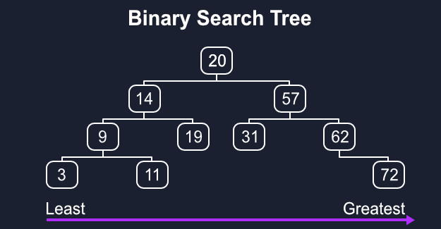

# Binary Search Tree (BST)



This repository contains two implementations:

- `recursive` — recursive implementation of insertion, deletion and traversals.
- `iterative` — iterative implementation (explicit stacks/loops) for insertion, deletion and traversals.

## Overview

A Binary Search Tree is a hierarchical data structure where each node has at most two children (left and right). The key property of a BST is that for any given node:

- All values in the left subtree are **less than** the node's value
- All values in the right subtree are **greater than** the node's value
- Both left and right subtrees are also valid BSTs

> **Note on duplicates:**
> The provided implementations treat equal values as "already present" — they do not insert duplicates.

## Features

### Core Operations

- **Insert**: Add new values while maintaining BST property
- **Delete**: Remove nodes with three different cases handling
- **Search**: Find if a value exists in the tree
- **Find Min/Max**: Get minimum and maximum values

#### Depth-First Search (DFS)

DFS explores as far as possible along each branch before backtracking. It uses a **stack** (either explicit stack or recursion call stack) and has three variants:

- **In-order**: Left → Root → Right (returns sorted array for BST)
- **Pre-order**: Root → Left → Right (useful for copying/serializing tree)
- **Post-order**: Left → Right → Root (useful for deletion/cleanup operations)

#### Breadth-First Search (BFS)

- **Level-order**: Breadth-first traversal by levels using a **queue**
- Visits all nodes at depth `d` before visiting nodes at depth `d+1`
- Useful for finding shortest path, level-wise processing

### Utility Functions

- **Height calculation**: Get tree height
- **Size counting**: Count total nodes
- **Validation**: Check if tree maintains BST property
- **Array conversion**: Export tree as sorted array

## Time & Space Complexity

### Core Operations

| Operation        | Average Case | Worst Case | Best Case |
| ---------------- | ------------ | ---------- | --------- |
| **Search**       | O(log n)     | O(n)       | O(1)      |
| **Insert**       | O(log n)     | O(n)       | O(1)      |
| **Delete**       | O(log n)     | O(n)       | O(1)      |
| **Find Min/Max** | O(log n)     | O(n)       | O(1)      |

### Traversal Operations

| Traversal       | Type | Time Complexity | Space Complexity                |
| --------------- | ---- | --------------- | ------------------------------- |
| **In-order**    | DFS  | O(n)            | O(h) recursive / O(h) iterative |
| **Pre-order**   | DFS  | O(n)            | O(h) recursive / O(h) iterative |
| **Post-order**  | DFS  | O(n)            | O(h) recursive / O(h) iterative |
| **Level-order** | BFS  | O(n)            | O(w) where w is max width       |

_Where `n` is number of nodes, `h` is height of tree, `w` is maximum width_

### Space Complexity Notes

- **Balanced BST**: Height = O(log n), so space = O(log n)
- **Skewed BST**: Height = O(n), so space = O(n)
- **Level-order traversals**: Space = O(w) where w can be up to n/2 in complete binary tree

## Depth-First Search (DFS) vs Breadth-First Search (BFS)

### DFS Characteristics

- **Strategy**: Goes deep first, explores one branch completely before moving to next
- **Data Structure**: Uses **Stack** (recursive call stack or explicit stack)
- **Memory Usage**: O(h) - height of tree (can be O(log n) for balanced, O(n) for skewed)
- **Use Cases**:
  - Tree serialization/deserialization (pre-order)
  - Expression tree evaluation (post-order)
  - Getting sorted data (in-order for BST)
  - Detecting cycles in graphs

### BFS Characteristics

- **Strategy**: Explores level by level, visits all neighbors before going deeper
- **Data Structure**: Uses **Queue** (FIFO - First In, First Out)
- **Memory Usage**: O(w) - maximum width of tree (can be up to n/2 for complete binary tree)
- **Use Cases**:
  - Finding shortest path in unweighted graphs
  - Level-wise tree processing
  - Finding minimum depth/height
  - Web crawling (exploring nearest links first)

## Level-Order Traversal Optimizations

The implementation includes three different level-order traversal approaches:

### 1. Standard Queue with `shift()` - O(n²) worst case

```javascript
levelOrder() // Uses queue.shift() - can be slow for large trees
```

### 2. Index-based Queue - O(n) optimized

```javascript
levelOrderIndex() // Uses index pointer instead of shifting
```

### 3. Level-by-level Grouping

```javascript
levelOrderByLevels() // Returns array of arrays, grouped by level
// Example output: [[50], [30, 70], [20, 40, 60, 80]]
```

## Delete Operation Cases

The delete operation handles three distinct cases:

1. **Leaf Node** (no children): Simply remove the node
2. **One Child**: Replace node with its child
3. **Two Children**: Replace with inorder successor (minimum value in right subtree)

## BST Properties & Advantages

### Advantages

- **Sorted Output**: In-order traversal gives sorted sequence
- **Efficient Search**: O(log n) average case for balanced trees
- **Dynamic Size**: Can grow and shrink during runtime
- **No Extra Memory**: No need to pre-declare size

### Disadvantages

- **Can Become Skewed**: O(n) operations in worst case
- **No Constant Time Operations**: Unlike hash tables
- **Memory Overhead**: Extra pointers for each node

## Tree Balance & Degeneration

### The Skewed Tree Problem

Since this BST implementation is **not self-balancing**, it can degenerate into a linear structure in worst-case scenarios:

```
// Inserting sorted data: [10, 20, 30, 40, 50]
10
 \
  20
   \
    30
     \
      40
       \
        50
```

This creates a **skewed/degenerate tree** where:

- **Height becomes O(n)** instead of optimal O(log n)
- **All operations degrade to O(n)** - same as a linked list
- **Space complexity increases** due to deeper recursion stack

### When Degeneration Occurs

- **Sorted Input**: Inserting already sorted data (ascending/descending)
- **Nearly Sorted Data**: Data with strong ordering patterns
- **Sequential Insertions**: Adding incremental values like 1,2,3,4,5...

### Prevention Strategies

1. **Random Insertion Order**: Shuffle data before insertion
2. **Self-Balancing Trees**: Use AVL trees, Red-Black trees, or Splay trees
3. **Input Validation**: Check for sorted patterns in input data

## Tree Structure Example

```
       50
      /  \
     30   70
    / |   | \
   20 40 60 80
```

**In-order**: 20, 30, 40, 50, 60, 70, 80 (sorted!)

**Pre-order**: 50, 30, 20, 40, 70, 60, 80

**Post-order**: 20, 40, 30, 60, 80, 70, 50

**Level-order**: 50, 30, 70, 20, 40, 60, 80

---

## Check implemented variants in this repository

> Recursive

- [`bst.js`](./bst.js)

> Iterative

- [`bst-iterative.js`](./bst-iterative.js)
