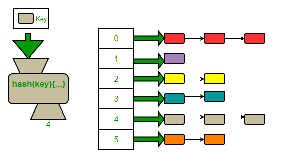

# Hash Table


# Overview

A **hash table** (hash map/dictionary) is a data structure that offers efficient key → value associations by using a _hash function_ to map keys to positions (buckets) in an array. The goal is to achieve average-case **O(1)** time for lookup, insert and delete.

This repository contains several implementations in JavaScript:

- Separate chaining with linked lists
- Open addressing with linear probing
- Open addressing with quadratic probing
- Open addressing with double hashing

Each variant is implemented as a standalone file to compare design choices and trade-offs.

# Core concepts

- **Hash function:** maps arbitrary keys (often converted to strings) to integer indices in `[0..m-1]` where `m` is the table capacity. A good hash function distributes keys uniformly.
- **Collision:** when two different keys map to the same index. Collision resolution strategies are required.
- **Load factor**: `size / capacity`. Thresholds for resizing per collision strategy affect performance.
- **Resize / Rehash:** when the load factor crosses a threshold, the table is resized and existing entries re-inserted with the new capacity and hash mapping.
- **Tombstones:** in open addressing, deleted slots are often marked with a tombstone sentinel to preserve probe sequences.

---

# Properties of Good Hash Functions — Notes for Hash Tables

## Overview

A hash function maps keys (of arbitrary type) to integer values (hash codes). For use in hash tables the hash function is a critical component — its quality determines collision rate, performance of probes/buckets and robustness against adversarial inputs. This document lists desirable properties of hash functions, explains why they matter, and gives practical recommendations.

---

## Desirable properties (with explanations)

### 1. Determinism

**Definition:** The function always returns the same hash for the same input.

**Why it matters:** Hash tables depend on stable mapping. Non-deterministic hashing breaks lookup, insert and delete.

### 2. Uniform distribution (low bias)

**Definition:** Hash outputs are evenly distributed across the output domain for realistic key distributions.

**Why it matters:** Uniformity minimizes collisions and balances bucket occupancy or probe lengths, giving near-O(1) average operations.

### 3. Avalanche / strong mixing

**Definition:** Small changes in input produce large, unpredictable changes in the hash output bits.

**Why it matters:** Prevents many similar keys (e.g., sequential integers, similar strings) from clustering into the same buckets.

### 4. Low collision rate (for the expected key set)

**Definition:** Different keys rarely map to the same hash value (or, for table indexing, to the same bucket).

**Why it matters:** Collisions degrade performance. A practical hash should keep collisions rare for the intended workloads.

### 5. Speed / low CPU cost

**Definition:** The hash computes quickly even for long keys.

**Why it matters:** Hashing is on the hot path for lookups/inserts; computationally expensive hashes slow the whole table. For general hash tables prefer fast non-cryptographic hashes.

### 6. Low memory / streaming friendliness

**Definition:** The algorithm uses little temporary memory and can process data in a streaming manner.

**Why it matters:** Hashing long keys should not allocate large buffers; streaming-friendly design allows hashing chunks without holding the whole key twice.

### 7. Good behavior across real-world key distributions

**Definition:** Works well not only for random inputs but for expected distributions (URLs, filenames, integers, timestamps).

**Why it matters:** Many hash functions look good on random data but fail on structured or adversarial data.

### 8. Resistance to adversarial inputs (if needed)

**Definition:** Difficult for an attacker to craft many keys that collide or produce long probe sequences.

**Why it matters:** Servers accepting untrusted keys (HTTP headers, form fields) can be DOSed by hash collisions. Use seeded or cryptographic-like hashing (or SipHash) when input is untrusted.

### 9. Low correlation between bits

**Definition:** Output bits are not simple linear or predictable functions of input bits.

**Why it matters:** Prevents pathological clustering when table size maps only a subset of output bits (e.g., low bits used for modulo).

---

## Practical design points for hash tables

- **Modulo mapping:** After computing the integer hash, you typically map to bucket index with `index = hash % capacity`. Ensure `hash` is unsigned or large enough to avoid negative indexes.
- **Power-of-two capacity vs prime capacity:**
  - Power-of-two sizes allow fast bitmasking (`hash & (m-1)`), but poor functions that only mix high bits can cause clustering.
  - Prime capacities are historically used with some probing strategies (esp. double hashing) to guarantee full-period probe sequences.
- **Secondary hash for double hashing:** Secondary hash must be non-zero and preferably coprime with table size. A common formula: `step = 1 + (hash2 % (capacity - 1))` when `capacity` is prime.
- **Seed / randomization:** Adding a secret seed/salt to hash function mitigates collision attacks from untrusted inputs.
- **Tombstones & rehashing:** Open addressing needs tombstones for deletes, but many tombstones degrade performance — schedule rehash/compact periodically.

---

## Cryptographic vs non-cryptographic hashes

- **Cryptographic hashes (SHA-2, SHA-3):**

  - Strong collision resistance and unpredictability.
  - Too slow for high-throughput hash tables.
  - Use if you need security guarantees (e.g., content hashing, signatures), not for general in-memory hash maps.

- **Non-cryptographic fast hashes (MurmurHash, xxHash, CityHash, FarmHash, FNV-1a):**

  - Designed for speed and good distribution.
  - Best choice for general-purpose hash tables.
  - Use seeded variants or SipHash when input is untrusted.

- **SipHash:**
  - A fast keyed hash that provides resistance to hash-flooding attacks.
  - Widely adopted as a secure hash for hash-table keys in languages where inputs are untrusted.

---

## Common real-world choices (short notes)

- **djb2 / sdbm / FNV-1a** — simple, suitable for small demos; may show weaknesses on adversarial inputs or certain patterns.
- **MurmurHash (Murmur3)** — good speed and distribution, widely used.
- **xxHash / CityHash / FarmHash** — extremely fast and good distribution for non-cryptographic use.
- **SipHash** — recommended when inputs are untrusted and you need DOS protection.
- **cryptographic hashes (SHA-256)** — use only when collision resistance / security is primary and cost is acceptable.

---

## Quick JS examples

### djb2 (simple educational hash)

```js
function djb2(str) {
    let hash = 5381
    for (let i = 0; i < str.length; i++) {
        hash = (hash << 5) + hash + str.charCodeAt(i) // hash * 33 + c
        // keep as 32-bit unsigned:
        hash >>>= 0
    }
    return hash >>> 0 // non-negative integer
}
```

---

## Separate chaining



**Idea.** Each bucket is a linked list (or other secondary structure). Colliding elements are stored in the bucket's list.

**Highlights of implementation in this repo:**

- Uses a `LinkedList` class to store `{ key, val }` entries per bucket.
- `djb2` string hashing (safe unsigned via `>>> 0`) used for keys converted to strings.
- Resizing doubles capacity + 1 and re-inserts entries.
- Default load factor: `0.7`.

**Pros:**

- Simple and robust.
- Insert/delete do not require tombstones.
- Load factor can exceed 1 and the table still works (only more chaining).
- No primary clustering.

**Cons:**

- Extra memory for linked list nodes (pointers).
- Additional pointer chasing can reduce cache locality.

## Open addressing — Linear probing


**Idea.** All entries stored directly in the array. On collision, probe linearly (`(h + i) % m`) until an empty or deleted slot is found.

**Highlights in this repo:**

- Uses `DELETED` symbol as tombstone marker.
- Early resize when `(size + 1) / capacity > loadFactor` (default load factor `0.5`).
- Tracks `firstDeleted` to reuse tombstone slots.

**Pros:**

- Very compact memory layout (no nodes / pointers) — good cache locality.
- Simple probe sequence.

**Cons:**

- **Primary clustering:** runs of occupied slots grow and degrade probe performance.
- Requires conservative load factor (≤ 0.5 recommended) to keep average probes low.

## Open addressing — Quadratic probing

**Idea.** Probe sequence uses quadratic formula: `pos = (h + c1*i + c2*i*i) % m`.

**Highlights:**

- Constructor ensures capacity is prime (the implementation uses `_nextPrime`).
- `c1` and `c2` are configurable (defaults `1, 1`).
- Tombstones handled same as other open addressing variants.

**Pros:**

- Reduces primary clustering compared to linear probing.
- Often better average probe lengths than linear probing under moderate load.

**Cons:**

- Possible secondary clustering for keys with identical initial hash.
- Implementation must ensure probe sequence visits all slots (using prime-sized table or other guarantees) — otherwise insertion may fail to find an empty slot even when free slots exist.

## Open addressing — Double hashing

**Idea.** Uses two hash functions `h1(key)` and `h2(key)` and probes with `pos = (h1 + i * h2) % m`.

**Highlights:**

- The secondary hash is computed as `1 + (raw % (capacity - 1))` so step is in `[1, capacity-1]` and non-zero.
- Capacity is kept prime in constructor (`_nextPrime`) so `h2` is coprime with `m`.
- Tombstone and resize strategies similar to others.

**Pros:**

- Minimal clustering (neither primary nor secondary in practice).
- Generally the best probe performance of open addressing schemes given good hash functions.

**Cons:**

- Slightly more computation per probe (two hashes).
- Requires more careful capacity choice (usually prime) for correctness.

# Time & space complexity

These are the typical complexities (assuming a good hash function):

| Variant           | Average Search | Average Insert | Average Delete | Worst-case Search/Insert/Delete | Space                            |
| ----------------- | -------------- | -------------- | -------------- | ------------------------------- | -------------------------------- |
| Separate chaining | O(1)           | O(1)           | O(1)           | O(n) (all keys collide)         | O(n + m) (n entries + m buckets) |
| Linear probing    | O(1)           | O(1)           | O(1)           | O(n)                            | O(m)                             |
| Quadratic probing | O(1)           | O(1)           | O(1)           | O(n)                            | O(m)                             |
| Double hashing    | O(1)           | O(1)           | O(1)           | O(n)                            | O(m)                             |

**Remarks:**

- Worst-case `O(n)` occurs when all keys collide (or pathological hash functions). Resizing and rehashing amortize occasional expensive operations: amortized cost per insert remains constant if resizing doubles capacity.

# Advantages & disadvantages (summary)

## Separate chaining

**Advantages**

- Good for workloads with high load factor or unpredictable insert/delete patterns.
- Deletions are simple.
- Easy to implement and reason about.

**Disadvantages**

- Extra memory overhead for secondary structures (nodes).
- Cache locality worse than contiguous array.

## Linear probing

**Advantages**

- Excellent cache locality — fast in practice when load factor is low.
- Simple implementation and compact storage.

**Disadvantages**

- Primary clustering can drastically increase probe lengths.
- Requires lower load factor (e.g., ≤ 0.5) for stable performance.

## Quadratic probing

**Advantages**

- Reduces primary clustering vs linear probing.
- Still good locality and compact storage.

**Disadvantages**

- Implementation correctness relies on table size and coefficients.
- Some probe sequences might not visit all slots if table size is not chosen carefully.

## Double hashing

**Advantages**

- Very low clustering and good probe distribution.
- Often best open addressing choice for general-purpose hash tables.

**Disadvantages**

- Slightly heavier per-probe cost (two hashes).
- Requires careful hash2 design and usually prime table sizes.

# Implementation notes & important details

- **Hash function:** this repo uses `djb2` (and `sdbm` for secondary) converted to unsigned (`>>> 0`) then modulo capacity. This is fast and OK for learning, but in production consider well-tested non-cryptographic hashes (xxHash, MurmurHash) or built-in language hash utilities.

- **Key conversion:** keys are converted to strings (`String(key)`). That means object keys will collide (e.g. `{}` and `{}` both become `"[object Object]"`). If you need object identity keys, use `Map` or maintain a custom `id` for objects.

- **Tombstones in open addressing:** necessary to preserve probe sequences when deleting. Tombstones must be handled carefully and may require periodic rehashing to remove many tombstones.

- **Capacity choice:** for quadratic and double hashing, prime table sizes are recommended. The quadratic implementation in this repo rounds `capacity` up to the next prime.

- **Load factor heuristics:**

  - Separate chaining: `0.7` or even higher is acceptable.
  - Linear probing: be conservative (`<= 0.5`) to avoid long probe sequences.
  - Quadratic probing: `0.5` is a reasonable default.
  - Double hashing: `0.7` is acceptable but monitor probe lengths.

- **Resizing policy:** resizing is implemented by allocating a larger buffer and reinserting existing items. This is `O(n)` for the resize but amortized `O(1)` per insert over many operations.

- **Equality semantics:** current implementations use `===` for key equality (or direct `slot.key === key` checks). When converting non-primitive keys to strings this changes semantics.

---

## Check implemented variants in this repository

> Separate chaining

- [`separate-chaining/hash-table.js`](./separate-chaining/hash-table.js)

> Open addressing

- [`open-addressing/linear-probing-HashTable.js`](./open-addressing/linear-probing-HashTable.js)
- [`open-addressing/quadratic-probing-HashTable.js`](./open-addressing/quadratic-probing-HashTable.js)
- [`open-addressing/double-hashing-HashTable.js`](./open-addressing/double-hashing-HashTable.js)
