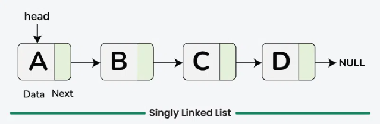
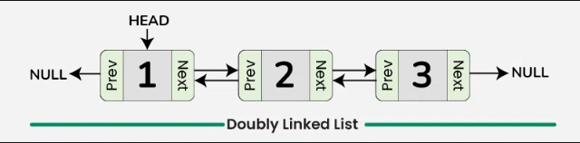
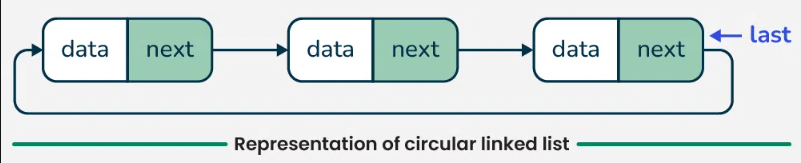
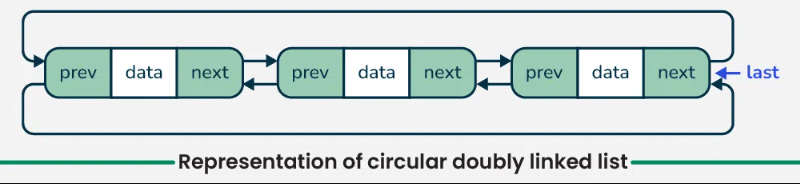

# Linked Lists

## What is a Linked List?

A **linked list** is a linear data structure where elements (nodes) are stored in sequence, but unlike arrays, elements are not stored in contiguous memory locations. Instead, each node contains:

- **Data**: The actual value stored
- **Pointer(s)**: Reference(s) to the next node (and previous node in doubly linked lists)

### Key Characteristics

- **Dynamic size**: Can grow or shrink during runtime
- **No random access**: Must traverse from head to reach a specific position
- **Memory efficient**: Only allocates memory as needed
- **Insertion/Deletion flexibility**: Easy to insert/delete at any position

## Time & Space Complexity Comparison

| Operation           | Singly LL | Singly LL (with tail) | Doubly LL | Circular SLL | Circular DLL |
| ------------------- | --------- | --------------------- | --------- | ------------ | ------------ |
| **Access/Search**   | O(n)      | O(n)                  | O(n)      | O(n)         | O(n)         |
| **Insert at Head**  | O(1)      | O(1)                  | O(1)      | O(1)         | O(1)         |
| **Insert at Tail**  | O(n)      | O(1)\*                | O(n)      | O(n)         | O(1)\*       |
| **Insert at Index** | O(n)      | O(n)                  | O(n)      | O(n)         | O(n)         |
| **Delete at Head**  | O(1)      | O(1)                  | O(1)      | O(1)         | O(1)         |
| **Delete at Tail**  | O(n)      | O(n)                  | O(n)      | O(n)         | O(1)\*       |
| **Delete at Index** | O(n)      | O(n)                  | O(n)      | O(n)         | O(n)         |
| **Delete by Value** | O(n)      | O(n)                  | O(n)      | O(n)         | O(n)         |

**Space Complexity**: O(1) for all operations (excluding input)

_\* O(1) when tail pointer is maintained_

## Detailed Implementation Analysis

### 1. Singly Linked List (SLL)

**Structure**: `[data|next] -> [data|next] -> [data|next] -> null`

> Nodes have a single next pointer and a head. Simple and memory-light; O(1) insert-at-head, O(n) access/append/delete by value or index.

**Key Features:**

- One pointer per node (`next`)
- Forward traversal only
- O(1) head insertion, O(n) tail insertion

### 2. Singly Linked List with Tail

**Structure**: `HEAD -> [data|next] -> [data|next] -> [data|next] <- TAIL`

> SLL + a stored tail pointer. Keeps O(1) append at end.

**Key Features:**

- Maintains both `head` and `tail` pointers
- O(1) insertion at both ends
- Automatic tail pointer management
- Ideal for FIFO operations

### 3. Doubly Linked List (DLL)

**Structure**: `null <- [prev|data|next] <-> [prev|data|next] <-> [prev|data|next] -> null`

> Each node has pointers to both next and previous nodes, enabling bidirectional traversal.

**Key Features:**

- Two pointers per node (`next` and `prev`)
- Bidirectional traversal
- Easier node deletion (can remove itself)
- Better for complex navigation patterns

### 4. Circular Singly Linked List

**Structure**: `[data|next] -> [data|next] -> [data|next] -> (back to head)`

> Last node points back to head. No "end" to the list - useful for round-robin algorithms.

**Key Features:**

- Tail connects back to head
- No null termination
- Continuous cycling through elements
- Perfect for cyclic processes

### 5. Circular Doubly Linked List

**Structure**: `<-> [prev|data|next] <-> [prev|data|next] <-> [prev|data|next] <-> (circular)`

> DLL + circular (head.prev === tail). Wrap-around in both directions, efficient inserts/removes at both ends and anywhere with node reference.

**Key Features:**

- Circular + bidirectional
- Head's `prev` points to tail
- Tail's `next` points to head
- Maximum navigation flexibility

## Use Cases by Type

### Singly Linked List

- **Stacks**: LIFO operations
- **Simple queues** (with tail pointer)
- **Undo functionality**
- **Basic sequential processing**

### Doubly Linked List

- **LRU Cache**: Easy to move nodes to front/back
- **Deques**: Double-ended queues
- **Browser history**: Forward/back navigation
- **Music playlists**: Skip forward/backward

### Circular Lists

- **Round-robin scheduling**: CPU process scheduling
- **Multiplayer games**: Turn management
- **Circular buffers**: Fixed-size rotating storage
- **Josephus problem**: Mathematical elimination problems

## Common Operations Implemented

All implementations include:

- `insertAtHead(value)` - Add element at beginning
- `insertAtTail(value)` - Add element at end
- `insertAt(index, value)` - Add element at specific position (0..size)
- `deleteAt(index)` - Remove and return value at index.
- `delete(value)` - Find and remove first node with value, return `true/false`.
- `get(index)` - Return value at index or `undefined` if out of bounds.
- `find(predicate)` - Search with custom function
- `contains(value)` - Check if value exists
- `reverse()` - Reverse the list order
- `toArray()` - Convert to JavaScript array, returns an array of values.
- `clear()` - Remove all elements
- `size()` - Returns number of elements (current length).
- `isEmpty()` - Check if list is empty.
- `toString(separator)` — string representation using `toArray()`.
- `[Symbol.iterator]()` — iterator to `for...of`-iterate values safely.

---

## Check implemented variants in this repository

> Singly

- [`singly/sll.js`](./singly/sll.js)
- [`singly/sll-with-tail.js`](./singly/sll-with-tail.js)

> Doubly

- [`doubly/dll.js`](./doubly/dll.js)

> Circular

- [`circular/ssl-circular.js`](./circular/sll-circular.js)
- [`circular/dll-circular.js`](./circular/dll-circular.js)
