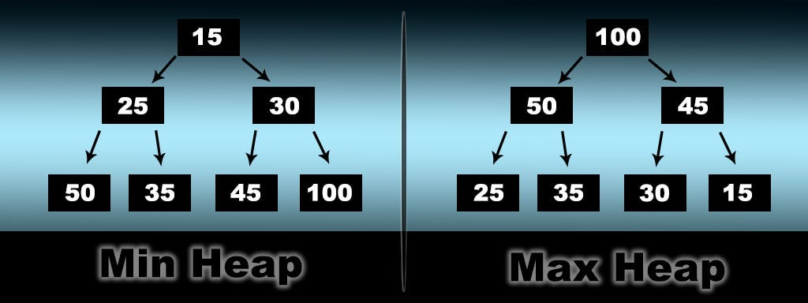

# 🧺 Priority Queue and Binary Heap

---

## 📌 Description

A **Priority Queue** is a data structure where each element has a _priority_.  
The element with the **highest priority** is always served first.

Priority Queues are usually implemented using a **Binary Heap** — a complete binary tree stored in an array, allowing for efficient insertions and deletions.

There are two main types:

- **Max Heap** – the largest element is always at the root.
- **Min Heap** – the smallest element is always at the root.

---

## ⚙️ How Binary Heap Works

A Binary Heap is represented as an array.

For an element at index `i`:

- **Left Child** = `2 * i + 1`
- **Right Child** = `2 * i + 2`
- **Parent** = `Math.floor((i - 1) / 2)`

This allows navigation **without using pointers**, making the structure compact and efficient.

---

## 🔺 Max Heap

### ✅ Description

- Every parent node is **greater than or equal to** its children.
- The **maximum element** is always at the root.

Used when you need **quick access to the largest value**.

### 🔄 Key Operations

- **insert(value)**: Add value to end, then move it up (`heapifyUp`) until the heap is valid.
- **extractMax()**: Remove root (max), replace it with the last element, and fix the heap using `heapifyDown`.
- **heapifyUp()**: Swap current node with parent while current > parent.
- **heapifyDown()**: Swap current node with larger child while any child > current.

---

## 🔻 Min Heap

### ✅ Description

- Every parent node is **less than or equal to** its children.
- The **minimum element** is always at the root.

Used when you want **fast access to the smallest value**.

### 🔄 Key Operations

- **insert(value)**: Add value to the end, then use `heapifyUp` to maintain order.
- **extractMin()**: Remove root (min), move last to root, and reorder using `heapifyDown`.
- **heapifyUp()**: While current < parent, swap.
- **heapifyDown()**: While any child < current, swap with smaller child.

---

## 🎨 Visual

---

## ⏱️ Time and Space Complexity

| Operation | Max Heap | Min Heap |
| --------- | -------- | -------- |
| Insert    | O(log n) | O(log n) |
| Extract   | O(log n) | O(log n) |
| Peek      | O(1)     | O(1)     |
| Space     | O(n)     | O(n)     |

---

## 📦 Properties

- **Stable**: ❌ No (order of equal elements not preserved)
- **In-place**: Yes ✅
- **Recursive**: Depends on implementation (heapify can be recursive or iterative)

---

## 💡 When to Use

- You need fast access to min or max elements.
- Scheduling tasks with priorities.
- Algorithms like Dijkstra, A\*, Huffman Coding.
- Building data streams like top-K elements, leaderboards, etc.

---

## ❌ When _Not_ to Use

- When you need stable sort.
- When you require random access by index.
- When insertion order matters for duplicates.

---

## 🔗 Useful Resources

- [Priority Queue on Wikipedia](https://en.wikipedia.org/wiki/Priority_queue)

---

## 🧠 Quick Recap

> A Priority Queue reorders elements based on importance.
> Binary Heaps (Min or Max) are used to implement them efficiently.
> With just a few index formulas, you get powerful priority-based control.

---

👨‍💻 Max Heap iterative implementation: [`max-heap-iterative.js`](./MaxPriorityQueue/max-heap-iterative.js)

👨‍💻 Max Heap recursive implementation: [`max-heap-recursive.js`](./MaxPriorityQueue/max-heap-recursive.js)

👨‍💻 Min Heap iterative implementation: [`min-heap-iterative.js`](./MinPriorityQueue/min-heap-iterative.js)

👨‍💻 Min Heap recursive implementation: [`min-heap-recursive.js`](./MinPriorityQueue/min-heap-recursive.js)
