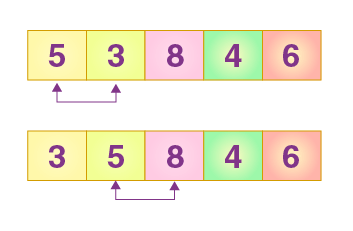
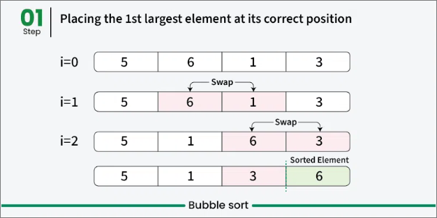
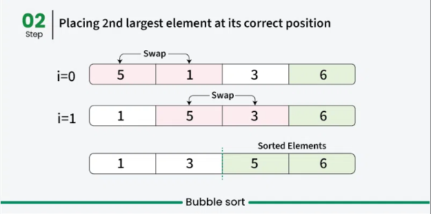
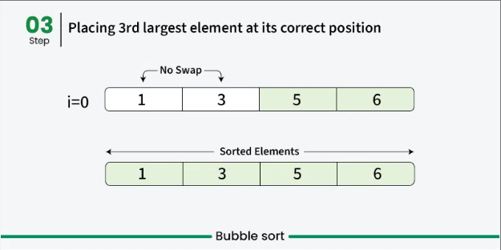

# 🫧 Bubble Sort



---

## 📌 Description

**Bubble Sort** is a simple comparison-based sorting algorithm.  
It repeatedly steps through the array, compares adjacent elements, and **swaps them if they are in the wrong order**.  
This process continues until no more swaps are needed, indicating that the array is sorted.

---

## ⚙️ How It Works (Step-by-Step)

1. Start from the beginning of the array.
2. Compare the current element with the next one.
3. If they are in the wrong order, swap them.
4. Repeat the process for all elements.
5. After each full pass, the largest element "bubbles" to the end.
6. Repeat until the array is sorted.

---

## 🧠 Example

```js
Input: `[4, 3, 1, 5]`

First pass:
[4, 3, 1, 5] → [3, 4, 1, 5]
[3, 4, 1, 5] → [3, 1, 4, 5]
[3, 1, 4, 5] → [3, 1, 4, 5] (no swap)

Second pass:
[3, 1, 4, 5] → [1, 3, 4, 5]

Third pass:
No swaps → array is sorted.
```

---

## Visual





---

## ⏱️ Time and Space Complexity

| Case    | Time Complexity | Explanation                        |
| ------- | --------------- | ---------------------------------- |
| Best    | `O(n)`          | Optimized version detects no swaps |
| Average | `O(n²)`         | Nested loops for all pairs         |
| Worst   | `O(n²)`         | Reverse-sorted input               |
| Space   | `O(1)`          | In-place, uses no extra memory     |

---

## 📦 Properties

- **Stable**: Yes ✅
- **In-place**: Yes ✅
- **Recursive**: No ❌ (typically implemented iteratively)

---

## 💡 When to Use

- For educational purposes
- When working with very small datasets
- When the array is _almost_ sorted (best-case: `O(n)`)

---

## ❌ When _Not_ to Use

- On large datasets
- When performance is important  
  (Use Merge Sort, Quick Sort, or other efficient algorithms instead)

---

## 🔗 Useful Resources

- [Bubble Sort on Wikipedia](https://en.wikipedia.org/wiki/Bubble_sort)
- [Bubble Sort Visualized](https://visualgo.net/en/sorting)
- [Bubble Sort Explained (YouTube)](https://www.youtube.com/results?search_query=bubble+sort+visualization)

---

## 🧠 Quick Recap

> Repeatedly swap adjacent elements if they are in the wrong order.  
> After each pass, the largest element moves (bubbles) to the end.  
> Easy to write, not efficient for big data.

---

👨‍💻 Check the implementation in [`bubble-sort.js`](./bubble-sort.js)
