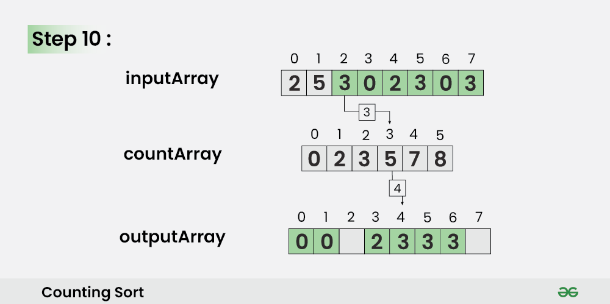

# 🧮 Counting Sort


---

## 📌 Description

**Counting Sort** is a non-comparison-based sorting algorithm that works by **counting how many times each value appears** in the input.  
Then it uses this frequency information to place elements in their correct sorted positions.

It is extremely efficient for sorting integers within a known and limited range.

---

## ⚙️ How It Works (Step-by-Step)

1. Find the minimum and maximum values in the array.
2. Create a `count` array that stores the frequency of each value.
3. **(Optional but important)** Convert the count array to a **prefix sum** array — this allows you to calculate the **correct sorted index** for each element and ensures **stability**.
4. Iterate over the input array **in reverse order** and place each element into the output array using the prefix-sum positions.
5. Copy the sorted array back to the original array (if needed).

---


## 🧠 Example

```js
Input: `[4, 2, 2, 8, 3]`
Step 1: Find min = 2, max = 8
Range size = 8 - 2 + 1 = 7
Create count array of size 7: [0, 0, 0, 0, 0, 0, 0]

Step 2: Count occurrences
[4, 2, 2, 8, 3] → count = [0, 2, 1, 1, 0, 0, 1]
(index 0 corresponds to value 2)

Step 3: Build prefix sum
count = [0, 2, 3, 4, 4, 4, 5] // tells us where to place each value

Step 4: Traverse input in reverse
→ Place each element in the correct position in output array using count array
→ Decrease count for that value after placing

Result: [2, 2, 3, 4, 8] — stable
```

## 🧠 Example Without Prefix Sum (Not Stable)

```js
Input:  
[
  { id: 1, score: 3 },
  { id: 2, score: 2 },
  { id: 3, score: 3 },
  { id: 4, score: 1 }
]

Sort by score using Counting Sort without prefix sum:
    1. Count how many times each score appears → [0, 1, 1, 2]
    2. Fill sorted array:

[
  { id: 4, score: 1 },
  { id: 2, score: 2 },
  { id: 3, score: 3 }, // appears before id:1 (wrong order)
  { id: 1, score: 3 }
]
```
## ✅ Example With Prefix Sum (Stable)
```js
Input (same):
[
  { id: 1, score: 3 },
  { id: 2, score: 2 },
  { id: 3, score: 3 },
  { id: 4, score: 1 }
]

Steps:
    1. Count: [0, 1, 1, 2]
    2. Convert to prefix sum: [0, 1, 2, 4]
    3. Traverse input in reverse and place using prefix positions:

[
  { id: 4, score: 1 },
  { id: 2, score: 2 },
  { id: 1, score: 3 },
  { id: 3, score: 3 }
]

✅ Result is stable — elements with the same score appear in original order.
```
---

## Visual





---

## ⏱️ Time and Space Complexity

| Case         | Time Complexity | Explanation                                |
|--------------|------------------|--------------------------------------------|
| Best         | `O(n + k)`       | `n` is input size, `k` is range size       |
| Average      | `O(n + k)`       | Efficient for small integer ranges         |
| Worst        | `O(n + k)`       | Avoid if `k` is too large                  |
| Space        | `O(k + n)`       | Uses extra arrays for counting and output  |

---

## 📦 Properties

- **Stable**: ✅ *only when using prefix sum logic*  
- **In-place**: ❌ (requires output array)  
- **Non-comparison-based** ✅  
- **Only works on integers or discrete values** ✅  
- **Super fast for small, bounded ranges** ✅

---

## ⚠️ Stability Note

> By default, Counting Sort is **not stable**.  
> To make it **stable**, we:
>
> - Convert the `count` array into a **prefix sum array**
> - Traverse the input **from right to left**
> - Place each element into the output array using its final position from the prefix sum
>
> This ensures that **equal elements appear in the same order** as in the original array.

---

## 💡 When to Use

- When sorting non-negative integers (or small bounded integer ranges)
- When performance matters more than memory
- When stability is required (after applying prefix sum logic)

---

## ❌ When *Not* to Use

- For large or sparse integer ranges (e.g., 1–10⁶ with only 5 elements)
- For floating-point numbers or general-purpose sorting

---

## 🔗 Useful Resources

- [Counting Sort on Wikipedia](https://en.wikipedia.org/wiki/Counting_sort)
- [Counting Sort Visualized](https://visualgo.net/en/sorting)
- [Counting Sort Explained (YouTube)](https://www.youtube.com/results?search_query=counting+sort+stable+prefix+sum)

---

## 🧠 Quick Recap

> Count → Prefix sum → Place elements in output  
> Use prefix sum for **stable sorting**  
> Best for integers in a small range  
> Very fast — no comparisons, but requires extra memory

---

👨‍💻 Check the implementation in [`counting-sort.js`](./counting-sort.js)
