# 🗃️ Heap Sort

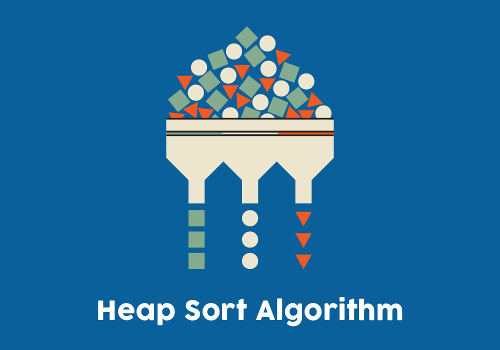

---

## 📌 Description

**Heap Sort** is a comparison-based sorting algorithm that uses a **Binary Heap** data structure.  
It first builds a heap from the input data, then repeatedly extracts the maximum (or minimum) element from the heap and places it at the end of the array.

- 📌 When using a **Max Heap** in Heap Sort, elements are extracted in **descending order**, and when using a **Min Heap**, they are extracted in **ascending order**.

This results in a **sorted array** in-place with no need for extra memory.

---

## ⚙️ How It Works (Step-by-Step)

1. Build a **Max Heap** from the unsorted array.
2. The largest element will now be at the root (index 0).
3. Swap the root with the last element.
4. Reduce the heap size by 1 and **heapify** the root again to maintain max-heap property.
5. Repeat the process until all elements are sorted.

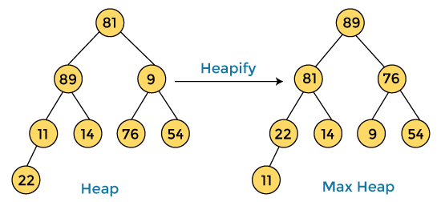

---

## 🧠 Example

```js
Input: [4, 10, 3, 5, 1]

Step 1: Build Max Heap → [10, 5, 3, 4, 1]

Step 2: Swap 10 with 1 → [1, 5, 3, 4, 10]
         heapify → [5, 4, 3, 1, 10]

Step 3: Swap 5 with 1 → [1, 4, 3, 5, 10]
         heapify → [4, 1, 3, 5, 10]

Step 4: Swap 4 with 3 → [3, 1, 4, 5, 10]
         heapify → [3, 1, 4, 5, 10]

Step 5: Swap 3 with 1 → [1, 3, 4, 5, 10]

Result: [1, 3, 4, 5, 10]
```

---

## 🎨 Visual

- Treat the Array as a Complete Binary Tree

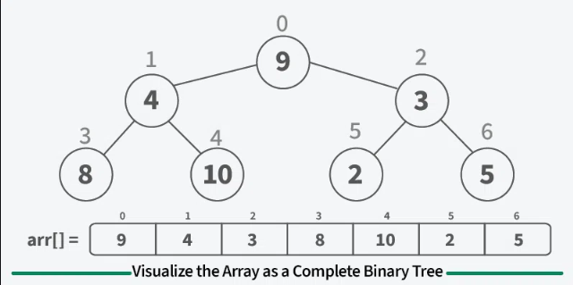

- Build a Max Heap

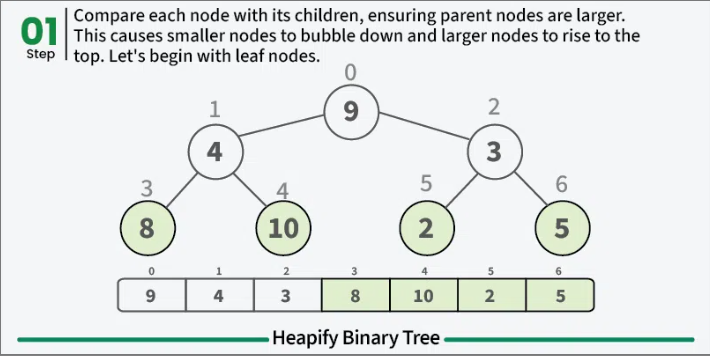
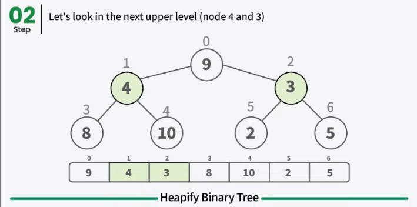
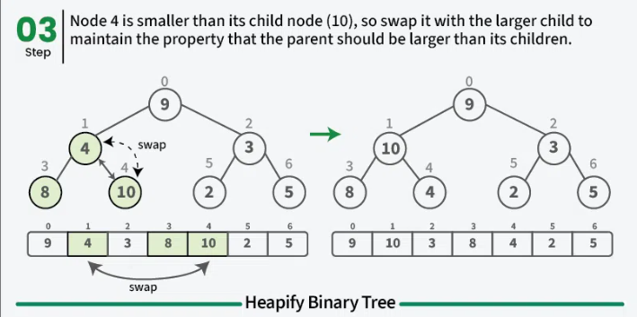

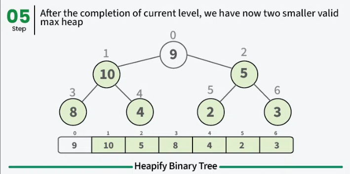
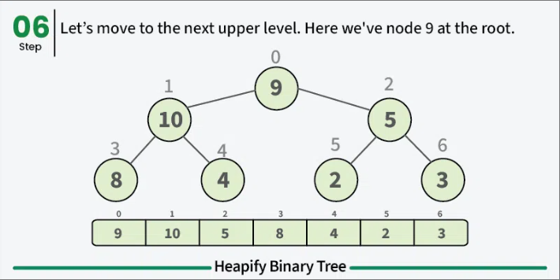


- Sort the array by placing largest element at end of unsorted array.

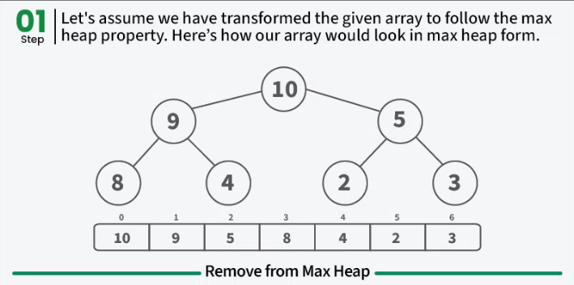
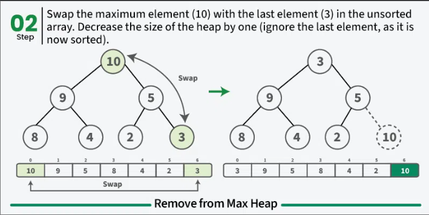
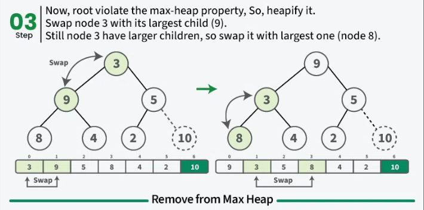
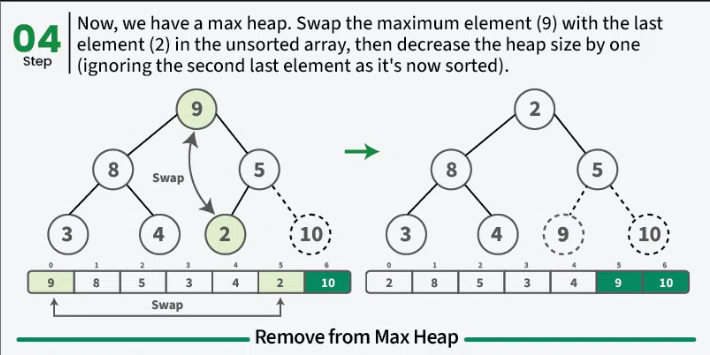
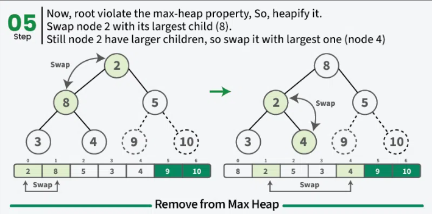


## ⏱️ Time and Space Complexity

| Case    | Time Complexity | Explanation                                |
| ------- | --------------- | ------------------------------------------ |
| Best    | `O(n log n)`    | Always uses heap construction + reordering |
| Average | `O(n log n)`    | Heapify on each extraction                 |
| Worst   | `O(n log n)`    | Consistent performance                     |
| Space   | `O(1)`          | In-place, uses no extra memory             |

---

## 📦 Properties

- **Stable**: No ❌
- **In-place**: Yes ✅
- **Recursive or Iterative**: Both versions possible
- **Efficient for small or nearly sorted arrays** ✅

---

## 💡 When to Use

- When you need guaranteed O(n log n) performance
- When you want an in-place sort with no extra memory
- For large datasets where memory matters

---

## ❌ When _Not_ to Use

- When stability is required (Heap Sort is not stable)
- When working with small datasets (Insertion Sort or Merge Sort may be simpler)
- When recursive implementation is preferred for readability

---

## 🔗 Useful Resources

- [Heap Sort on Wikipedia](https://en.wikipedia.org/wiki/Heapsort)
- [Binary Heap Explanation](https://www.geeksforgeeks.org/dsa/binary-heap/)

---

## 🧠 Quick Recap

> Build a Max Heap.  
> Repeatedly swap the root (max) with the last unsorted item.  
> Shrink the heap and heapify.  
> You get a sorted array in-place with consistent performance!

---

👨‍💻 Heap sort with Max Heap: [`heap-sort-MaxHeap.js`](./heap-sort-MaxHeap.js)

👨‍💻 Heap sort with Min Heap: [`heap-sort-MinHeap.js`](./heap-sort-MinHeap.js)
