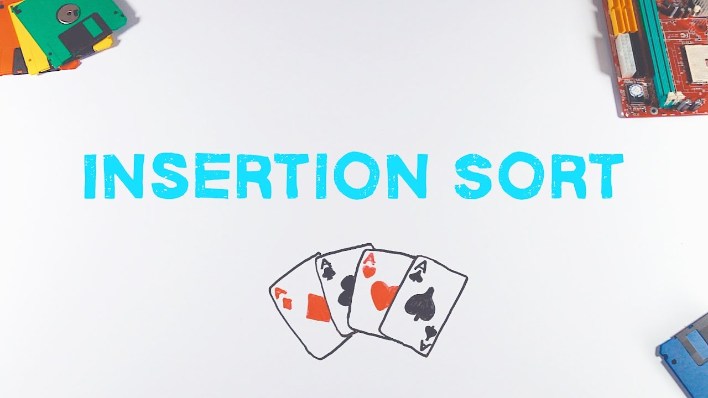
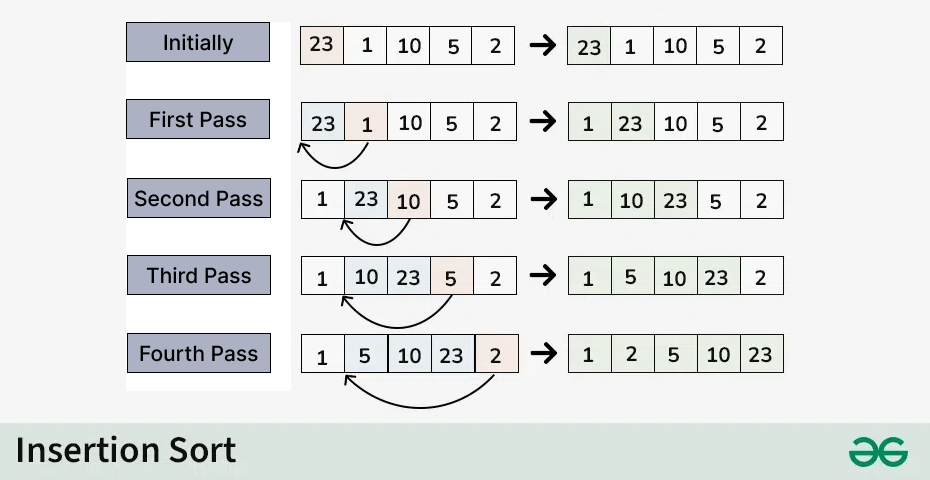

# 🧷 Insertion Sort



---

## 📌 Description

**Insertion Sort** builds the final sorted array one element at a time.  
It works similarly to how we sort playing cards in our hands — by inserting each new card into the correct position among the previously sorted cards.

---

## ⚙️ How It Works (Step-by-Step)

1. Start from the second element (index 1).
2. Compare it with elements before it.
3. Shift all larger elements one position to the right.
4. Insert the current element into the correct position.
5. Repeat until the entire array is sorted.

---

## 🧠 Example

```js
Input: `[4, 3, 1, 5]`
Index 1: 3 < 4 → shift 4 → insert 3
[4, 3, 1, 5] → [4, 4, 1, 5] → [3, 4, 1, 5]

Index 2: 1 < 4 and 3 → shift both → insert 1
[3, 4, 1, 5] → [3, 4, 4, 5] → [3, 3, 4, 5] → [1, 3, 4, 5]

Index 3: 5 > all → no change
Result: `[1, 3, 4, 5]`
```

---

## Visual

---

## 

## ⏱️ Time and Space Complexity

| Case    | Time Complexity | Explanation                            |
| ------- | --------------- | -------------------------------------- |
| Best    | `O(n)`          | Already sorted (minimal shifting)      |
| Average | `O(n²)`         | Each element compared with many others |
| Worst   | `O(n²)`         | Reverse-sorted array                   |
| Space   | `O(1)`          | In-place algorithm                     |

---

## 📦 Properties

- **Stable**: Yes ✅
- **In-place**: Yes ✅
- **Efficient for small or nearly sorted arrays** ✅

---

## 💡 When to Use

- When the array is nearly sorted
- For small datasets
- When stability is important
- In real-time systems where simplicity matters

---

## ❌ When _Not_ to Use

- On large datasets
- When consistent `O(n log n)` performance is required

---

## 🔗 Useful Resources

- [Insertion Sort on Wikipedia](https://en.wikipedia.org/wiki/Insertion_sort)
- [Insertion Sort Visualized](https://visualgo.net/en/sorting)
- [Insertion Sort Explained (YouTube)](https://www.youtube.com/results?search_query=insertion+sort+visualization)

---

## 🧠 Quick Recap

> Move through the array left to right, inserting each element into the correct position in the sorted part.  
> Great for small or almost-sorted arrays.  
> Easy to write, stable, and efficient for specific cases.

---

👨‍💻 Check the implementation in [`insertion-sort.js`](./insertion-sort.js)
