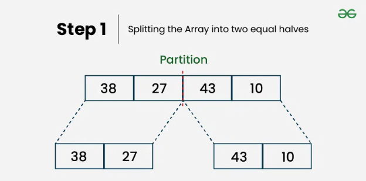
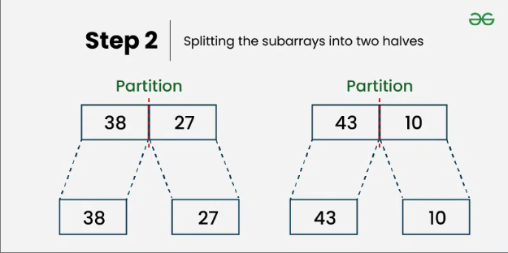
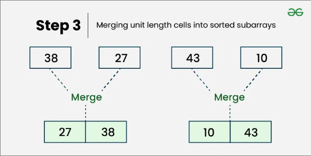
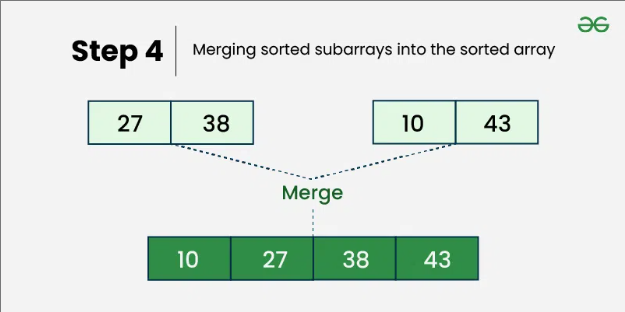

# 🔀 Merge Sort


---

## 📌 Description

**Merge Sort** is an efficient, general-purpose, and comparison-based sorting algorithm. It follows the **divide-and-conquer** paradigm by:

1. Dividing the array into halves,
2. Recursively sorting each half,
3. Merging the sorted halves into a single sorted array.

---

## ⚙️ How It Works (Step-by-Step)

1. If the array has 1 element, it's already sorted.
2. Otherwise:
   - Divide the array into two halves.
   - Recursively apply merge sort to each half.
   - Merge the sorted halves.

---

## 🧠 Example

```js
Input: [5, 2, 9, 1, 3]

// Step 1: Divide
[5, 2, 9, 1, 3] → [5, 2] and [9, 1, 3]

// Step 2: Recursively sort the halves
[5, 2] → [5], [2] → merge → [2, 5]
[9, 1, 3] → [9], [1, 3] → [1], [3] → merge → [1, 3] → merge with [9] → [1, 3, 9]

// Step 3: Merge final sorted halves
[2, 5] and [1, 3, 9] → merge → [1, 2, 3, 5, 9]

Output: [1, 2, 3, 5, 9]
```

---
## Visual





---

## ⏱️ Time and Space Complexity

| Case    | Time Complexity | Explanation                   |
| ------- | --------------- | ----------------------------- |
| Best    | `O(n log n)`    | Always divides and merges     |
| Average | `O(n log n)`    | Regardless of input           |
| Worst   | `O(n log n)`    | Even for reversed array       |
| Space   | `O(n)`          | Needs extra array for merging |

---

## 📦 Properties

- **Stable**: Yes ✅ (preserves the order of equal elements)
- **In-place**: No ❌ (requires extra memory)
- **Recursive**: Yes ✅

---

## 💡 When to Use

- When stability is required
- For sorting linked lists
- For large datasets where `O(n^2)` is too slow
- In external sorting (like file systems)

---

## 🔗 Useful Resources

- [Merge Sort on Wikipedia](https://en.wikipedia.org/wiki/Merge_sort)
- [Merge Sort Visualized](https://visualgo.net/en/sorting)
- [Merge Sort Explained (YouTube)](https://www.youtube.com/results?search_query=merge+sort+visualization)

---

## 🧠 Quick Recap

> Split → Sort → Merge  
> Works recursively, always `O(n log n)`, uses extra memory but gives guaranteed performance with stability.

---

👨‍💻 Check the implementation in [`merge-sort.js`](./merge-sort.js)
