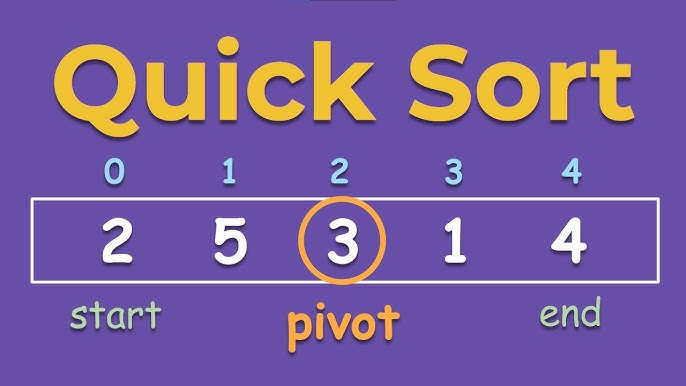
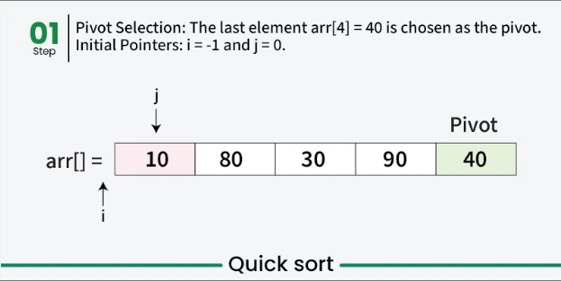
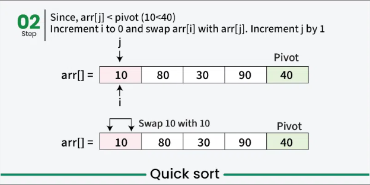
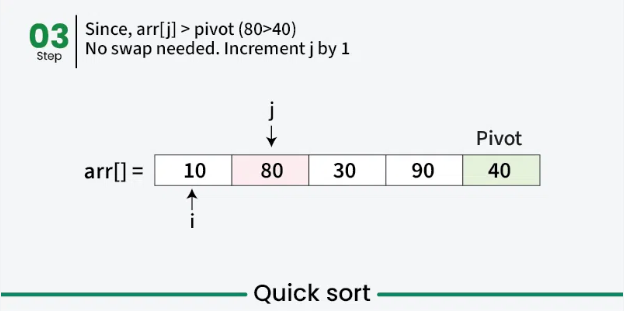
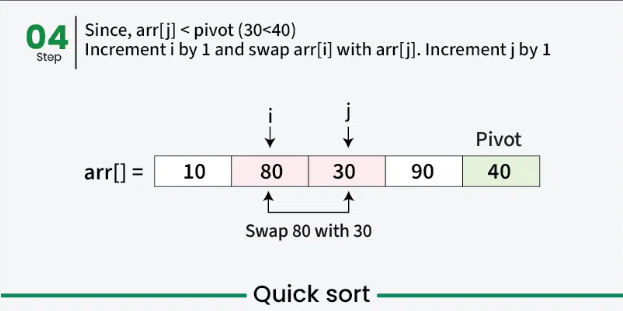
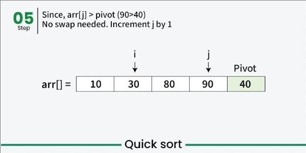
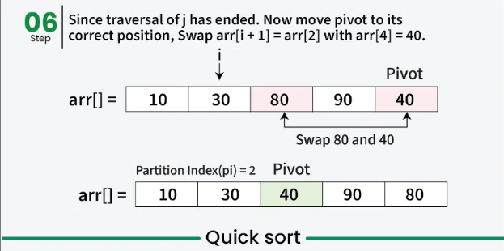

# ⚡ Quick Sort



---

## 📌 Description

**Quick Sort** is a fast, efficient, divide-and-conquer sorting algorithm.  
It works by selecting a **pivot** element, then **partitioning** the array so that:

- All elements less than the pivot come before it
- All elements greater than the pivot come after it

Then it recursively applies the same logic to the left and right subarrays.

---

## ⚙️ How It Works (Step-by-Step)

1. Choose a pivot element.
2. Partition the array:
   - Move all smaller elements to the left of the pivot
   - Move all greater elements to the right
3. Recursively apply the same steps to the left and right subarrays.

---

## ⚔️ Partition Schemes

### 🔸 Lomuto Partition (Simpler)

- Pivot is usually the **last element**
- Maintains a `boundary` index to swap values
- Easy to understand, but not the most efficient

```js
function lomutoPartiton(arr, low, high) {
	const pivot = arr[high]
	let insertPos = low
	for (let i = low; i < high; ++i) {
		if (arr[i] < pivot) {
			swap(arr, i, insertPos)
			insertPos++
		}
	}
	;[arr[i], arr[j]] = [arr[j], arr[i]]
	return insertPos
}
```

### 🔹 Hoare Partition (Faster)

- Pivot is usually the **middle element**
- Uses `two pointers` moving from both ends toward the center
- Fewer swaps, more efficient in practice

```js
function hoarePartition(arr, low, high) {
	let pivot = arr[Math.floor((low + high) / 2)]
	let left = low - 1
	let right = high + 1
	while (true) {
		do {
			left++
		} while (arr[left] < pivot)
		do {
			right--
		} while (arr[right] > pivot)
		if (left >= right) return right
		;[arr[left], arr[right]] = [arr[right], arr[left]]
	}
}
```

---

## 🎯 Pivot Selection Strategies

Choosing a good pivot is **critical** for performance. Different strategies exist:

| Strategy            | Description                                                |
| ------------------- | ---------------------------------------------------------- |
| **First Element**   | Simple, but causes worst-case performance on sorted arrays |
| **Last Element**    | Common with Lomuto; same issue as first element            |
| **Random Element**  | Reduces the risk of worst-case `O(n²)`                     |
| **Median of Three** | Picks median of `first`, `middle`, `last` → good balance   |

> ✅ **Best Practice:** Use **Random** or **Median-of-Three** pivot + **Hoare partition** for optimal performance in most cases.

---

## 🧠 Example

```js
Input: [5, 2, 9, 1, 3], pivot = 3
After partition: [2, 1, 3, 9, 5]
→ Then recursively sort [2, 1] and [9, 5]

Final result: [1, 2, 3, 5, 9]
```

---

## 🎨 Visual








---

## ⏱️ Time and Space Complexity

| Case    | Time Complexity | Explanation                               |
| ------- | --------------- | ----------------------------------------- |
| Best    | `O(n log n)`    | When pivot splits array evenly size       |
| Average | `O(n log n)`    | Balanced splits in most casesranges       |
| Worst   | `O(n²)`         | If pivot always ends up smallest/largest  |
| Space   | `O(log n)`      | Due to recursion stack (in-place sorting) |

> ⚠️ **Worst case** happens when the **smallest/largest** element is always chosen as pivot (e.g., sorted input with **Lomuto**).

---

## 📦 Properties

- **Stable**: ❌ (not stable by default)
- **In-place**: ✅ (doesn't require extra memory)
- **Divide-and-conquer**: ✅
- **Recursive**: ✅
- **Customizable partition strategy** ✅

---

## 💡 When to Use

- For large datasets where performance matters
- When memory usage must be minimal
- With good pivot strategy, it's faster than Merge Sort in practice

---

## ❌ When _Not_ to Use

- When stability is required
- On nearly sorted arrays with bad pivot choice (can degrade to O(n²))

---

## 🔗 Useful Resources

- [Quick Sort on Wikipedia](https://en.wikipedia.org/wiki/Quicksort)

---

## 🧠 Quick Recap

> Choose **pivot** → **partition** the array → **recurse** on both halves  
> Use **Lomuto** for simplicity, **Hoare** for better performance  
> Pick pivot **wisely**: `random` or `median-of-three` helps avoid worst-case  
> ✅ **In-place**, ⚡ **fast**, but ❌ **not stable**

---

👨‍💻 **Hoare Partition** implementation: [`quick-sort-hoare.js`](./quick-sort-hoare.js)  
👨‍💻 **Lomuto Partition** with the **last element as pivot**: [`quick-sort-lomuto-lastElement.js`](./quick-sort-lomuto-lastElement.js)  
👨‍💻 **Lomuto Partition** with **median-of-three pivot**: [`quick-sort-lomuto-medianOfThree.js`](./quick-sort-lomuto-medianOfThree.js)  
👨‍💻 **Lomuto Partition** with a **random pivot**: [`quick-sort-lomuto-randomPivot.js`](./quick-sort-lomuto-randomPivot.js)
